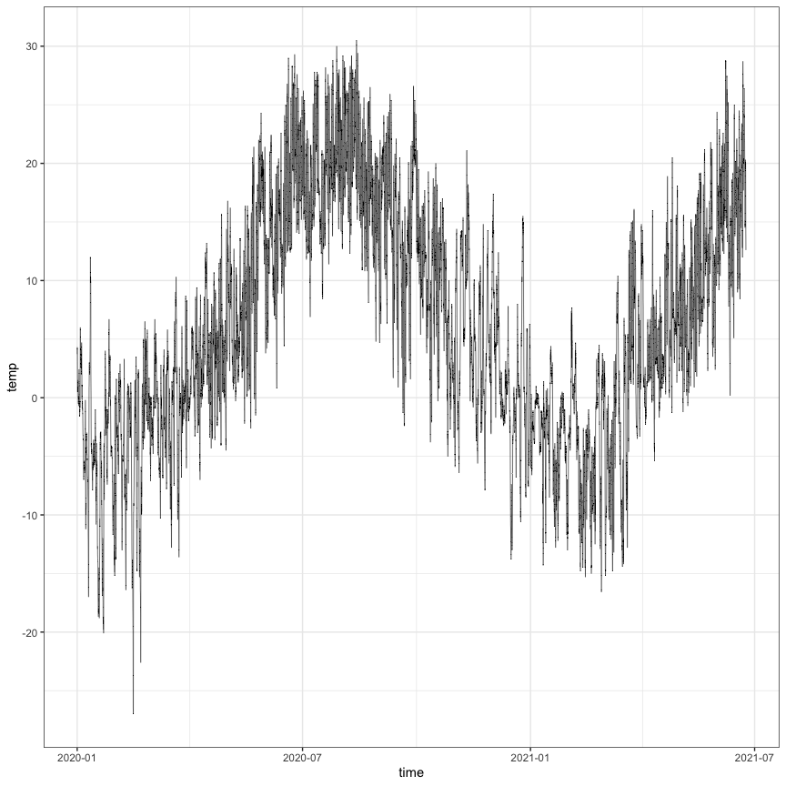

<style type="text/css">
p.caption {
  font-size: 18px;
}
</style>


# Affiliations {-}
^1^Mount Allison University, New Brunswick, Canada  

*corresponding author  

# Acknowledgements {-}
Brackets minus after header excludes header from numbering.  
ES was supported by the New Brunswick Wildlife Trust Fund and a Cleantech Internship.  
DAC was supported by the Canada Research Chairs.

# Overview
There are packages to support direct import from specific web data bases into R.
These packages streamline the general 'web scraping' processes, that can also be written from scratch.

Script based import supports:  
-reproducible auditing of import processes  
-higher throughput than cutting and pasting  
-fewer typographic errors

## Call a different .Rmd as a 'child' upon Knit.
This facilitates dividing projects into sub-sections.


### Introduction  {-}  
We can write an introduction (or other) section as an independent .Rmd, and then import it into the main document.
https://bookdown.org/yihui/rmarkdown-cookbook/child-document.html

# Materials & Methods  
## Set chunk options
Formatted display of content from .md file on GitHub site.
Upon knitr figures will be saved to 'Figs/'


## Load packages


## Citations of software packages
[@austCrshCitr2021; @bryanGooglesheets4AccessGoogle2021; @grolemundDatesTimesMade2011; @mcgowanGoogledriveInterfaceGoogle2020; @wickhamTidyverseEasilyInstall2017; @wilkeCowplotStreamlinedPlot2020; @xieKnitrGeneralPurposePackage2018]


## Set Project Variables  
Try to set all user-defined variables near top of .Rmd, in one place, to avoid or limit editing of downstream code.  
Assigning project-specific values to generic variables helps with re-use of code.

```r
EnCanStation <- "NAPPAN AUTO"
Sites <- c("Avonport","Danielsflats","GrandeAnse","Joggins","MarysPoint", "PecksCove")
Latitude <- 45.75
Longitude <- -64.49
Start <- 20200101000000
End <-Sys.time()

Drone_kph <- 20

TrimStart <- 20200401000000
TrimEnd <- 20200501000000
TideTolerance <- 5
```

# Results

## Search for Enviroment Canada weather station

```r
#search for StationNames containing the value of EnCanStation set above
StationNames <- weathercan::stations_search(EnCanStation)
StationNames
```

```
## # A tibble: 3 x 16
##   prov  station_name station_id climate_id WMO_id TC_id   lat   lon  elev tz    
##   <chr> <chr>             <dbl> <chr>       <dbl> <chr> <dbl> <dbl> <dbl> <chr> 
## 1 NS    NAPPAN AUTO       42083 8203702     71311 XNP    45.8 -64.2  19.8 Etc/G…
## 2 NS    NAPPAN AUTO       42083 8203702     71311 XNP    45.8 -64.2  19.8 Etc/G…
## 3 NS    NAPPAN AUTO       42083 8203702     71311 XNP    45.8 -64.2  19.8 Etc/G…
## # … with 6 more variables: interval <chr>, start <dbl>, end <dbl>,
## #   normals <lgl>, normals_1981_2010 <lgl>, normals_1971_2000 <lgl>
```

StationID 42083 based upon search for NAPPAN AUTO.  


## Download Environment Canada weather data

```r
#be careful; time is reported as AST without ADT I think
NappanWeather <- weathercan::weather_dl(station_ids = StationNames$station_id[1], start =  "2020-01-01", interval = "hour")

#force_tz is a lubridate function to set a timezone
NappanWeather <- NappanWeather %>%
  mutate(time = force_tz(ymd_hms(time),"America/Halifax"))

NappanWeatherDay <- weathercan::weather_dl(station_ids = StationNames$station_id[1], start =  "2020-01-01", interval = "day")

NappanWeatherDay <- NappanWeatherDay %>%
  mutate(date = force_tz(ymd(date),"America/Halifax"))
```

### Generate a Figure Caption
There are multiple approaches to generate captions.

```r
NappanTempPlot_cap <- "Temperature vs. Date at the Nappan Automated Weather Station"
```


For display as formatted .md on GitHub any chunks generating figures have to be a singleword chunk name.
Keep name of Chunk the same as name of Figure for in-line citations of numbered figures to work.
<div class="figure">

<p class="caption">(\#fig:NappanTempPlot)Temperature vs. Date at the Nappan Automated Weather Station</p>
</div>


# Discussion

In line reference to Figure \@ref(fig:NappanTempPlot)  

This works if Figure Captions are set up properly for knitting using bookdown.
The advantage is dynamic (re)numbering of figures in the knit output.

\newpage
### List of Figure Captions {-}

Figure \@ref(fig:NappanTempPlot)
Temperature vs. Date at the Nappan Automated Weather Station  

In line call to R object 'NappanTempPlot'.

\newpage


# Bibliography
